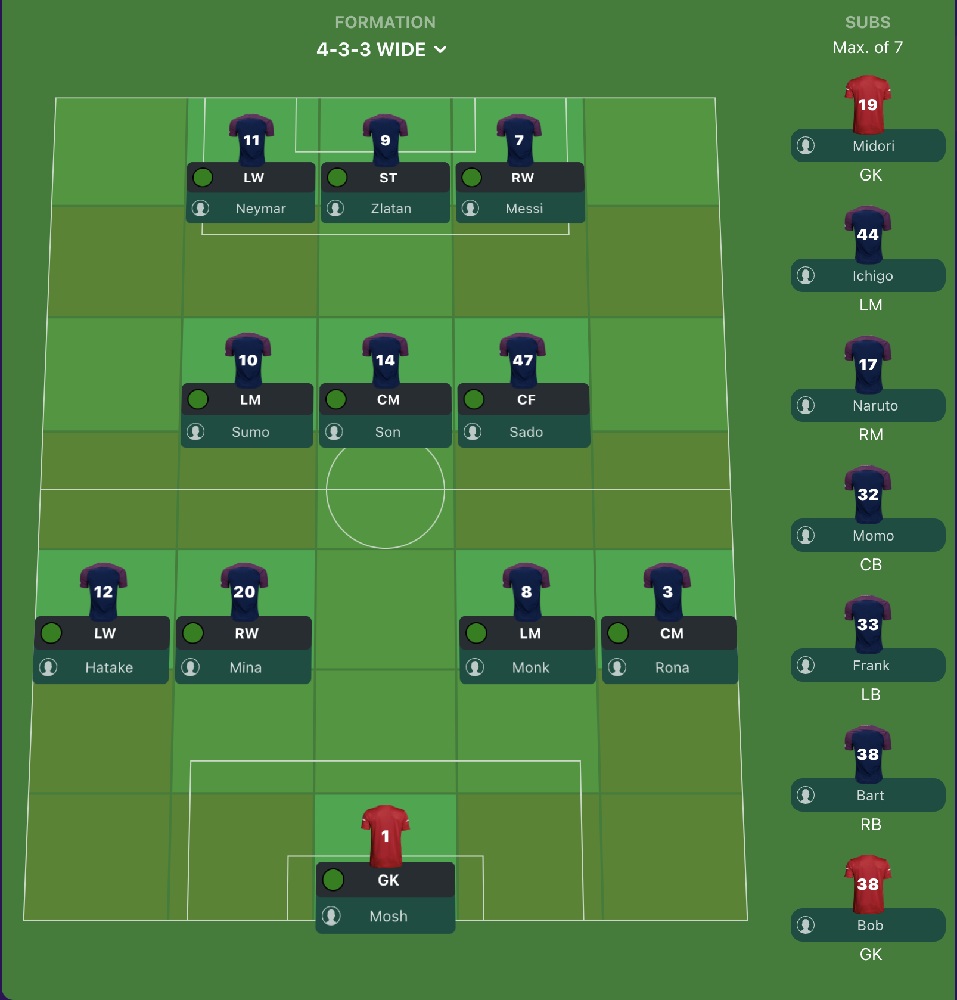

# Welcome to the Footium Frontend Developer Test

# Instructions

### You are presented with an empty project bootstrapped with `create-react-app` and the goal is to build this:

### Expected Features:

- Swap players on the pitch with players on the bench by dragging and dropping them
- Swap player positions on the pitch by dragging and dropping them

Here's a video of the expected behaviour

## Some things to keep in mind

- You are allowed to install any libraries you want.
- Readable Code is important.
- Feel free to get creative with it.
- Do as much as you can within the timeframe (it's totally fine if you can't finish).

### The data for the players can be found in:

[src/data.ts](src/data.ts)

### All images can be found in:

[public/assets/images](public/assets/images)

## Setup

In your CLI, in the project directory, ensure you have [node](https://nodejs.org/en/download/) installed and run:

`npm install`

then

`npm start`

Then open [http://localhost:3000](http://localhost:3000) to view it in the browser.
